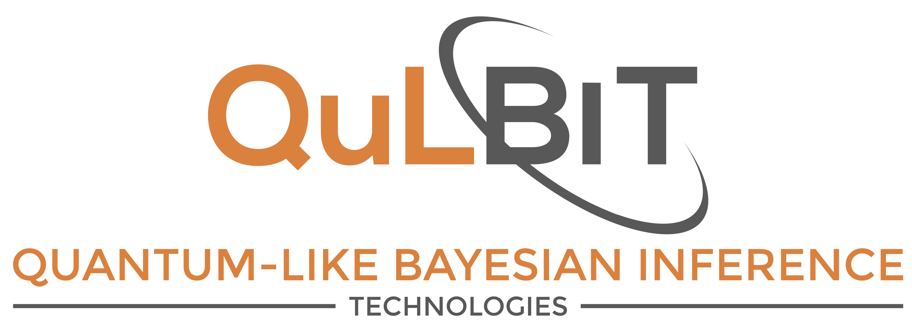
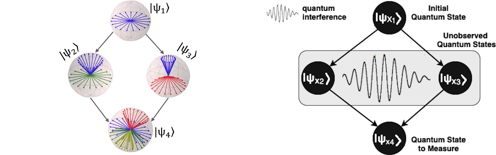
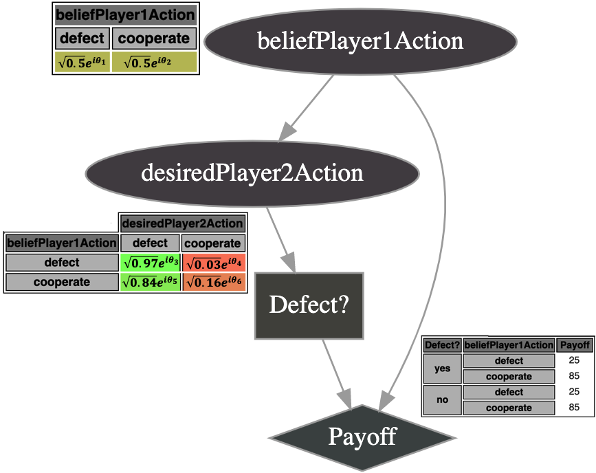
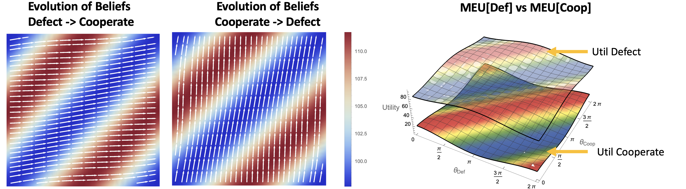
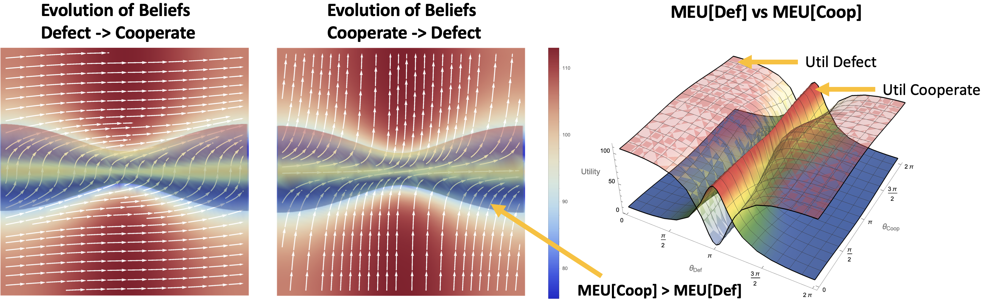

# QuLBIT - Quantum-Like Bayesian Inference Technologies

QuLBIT is the foundation of a new type of decision support system that deals with uncertainty using the formalisms of quantum mechanics. The main advantage of this framework is that it can capture human paradoxical and irrational decisions during the inference process, which can be very useful not only for cognitive systems, but also for decision-making systems that deal with human data. The quantum-like approach also enables the expression of a prediction using quantum interference effects.

This framework is currently structured in terms of modules in a clear, well-defined, and extendible architecture. All these modules correspond to models that have been published in different journals. We kindly ask to cite the papers connected to each module that you find useful for your research:

* **Quantum-Like Bayesian Networks Module**
	
	* Catarina Moreira and Andreas Wichert (2016), <a href="http://journal.frontiersin.org/article/10.3389/fpsyg.2016.00011/abstract">**Quantum-Like Bayesian Networks for Modeling Decision Making**</a>, *Frontiers in Psychology: Cognition*, 7.
	* Catarina Moreira and Andreas Wichert, <a href="http://journal.frontiersin.org/article/10.3389/fpsyg.2016.00011/abstract">**Interference Effects in Quantum Belief Networks**</a>, *Applied Soft Computing*, 25, 64-85, 2014
	
	

* **Quantum-Like Influence Diagrams Module**
	*  Catarina Moreira and Andreas Wichert (2018), <a href="http://cmoreira.eu/pdfs/conferences/QI_2018.pdf">**Introducing Quantum-Like Influence Diagrams for Violations of the Sure Thing Principle**</a>, *In Proceedings of the 11th International Conference on Quantum Interactions*.

 
	

* **Quantum Interference Effects Module**

   **Law of Balance:**
	* Andreas Wichert and Catarina Moreira (2018), <a href="http://cmoreira.eu/pdfs/conferences/short16.pdf">**Balanced Quantum-Like Model for Decision Making**</a>, *In Proceedings of the 11th International Conference on Quantum Interactions* 
	
	
	
	**Similarity Heuristic:**
	
	* Catarina Moreira and Andreas Wichert (2016), <a href="http://journal.frontiersin.org/article/10.3389/fpsyg.2016.00011/abstract">**Quantum-Like Bayesian Networks for Modeling Decision Making**</a>, *Frontiers in Psychology: Cognition*, 7.

   
   

